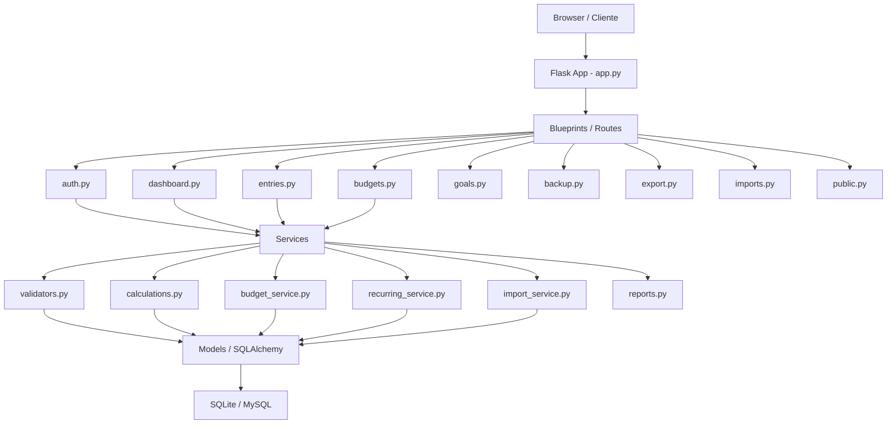
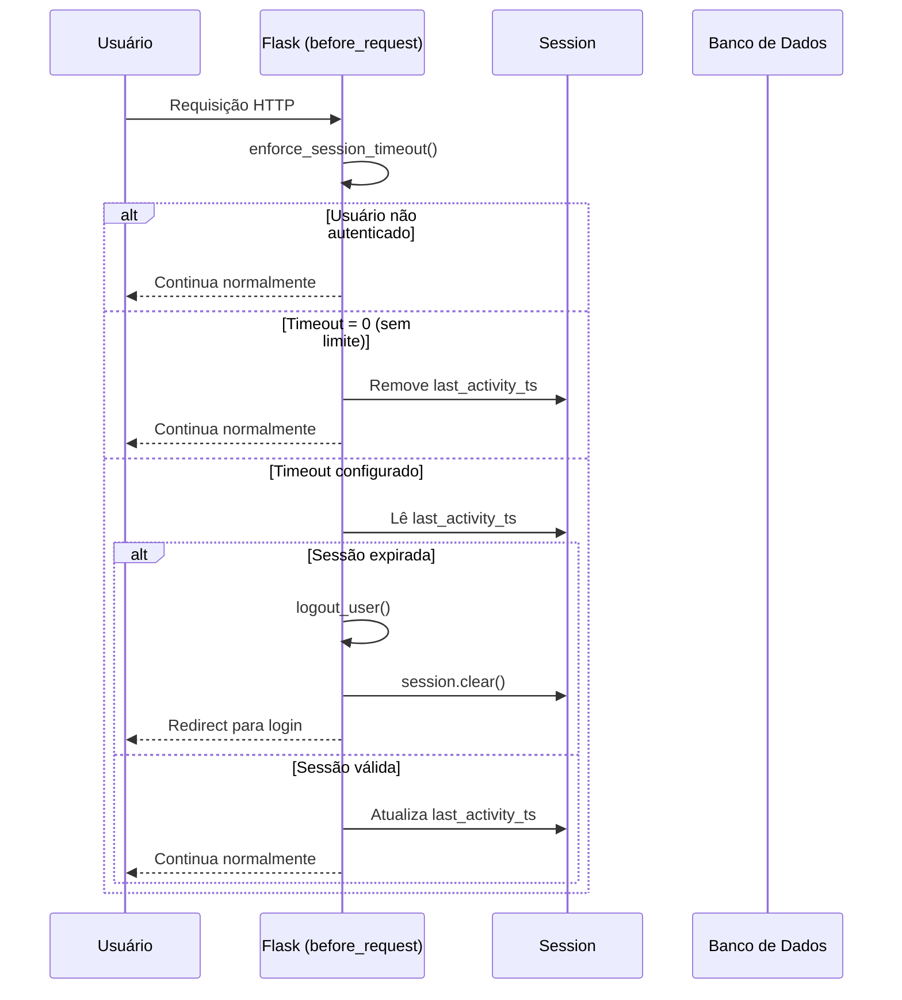

# Análise Completa do Sistema — Finora v1.1.0

# Análise Completa do Sistema — Finora v1.1.0

> **Escopo:** Análise minuciosa e detalhada cobrindo Segurança, Confiabilidade, Mantibilidade, Duplicações, Tamanho, Complexidade e Visual (UX).  
> **Base analisada:** Todos os arquivos do workspace `finora/` — modelos, rotas, serviços, templates, CSS, JS, testes e configurações.

---

## Visão Geral da Arquitetura



---

## 1. 🔐 Segurança

### ✅ Pontos Fortes

| Controle | Implementação | Arquivo |
|---|---|---|
| CSRF | `CSRFProtect(app)` + token em todos os formulários | `file:app.py`, todos os templates |
| Hashing de senha | `werkzeug.security.generate_password_hash` (PBKDF2) | `file:models/user.py` |
| Hashing de chave de recuperação | Mesmo mecanismo da senha | `file:models/user.py` |
| Cookies seguros | `SESSION_COOKIE_HTTPONLY`, `REMEMBER_COOKIE_HTTPONLY`, `SameSite=Lax`, `Secure` em produção | `file:config.py` |
| SECRET_KEY obrigatória em produção | Lança `RuntimeError` se ausente | `file:app.py` |
| Token de reset de senha | `URLSafeTimedSerializer` com expiração de 1 hora | `file:routes/auth.py` |
| Validação de imagem de perfil | `PIL.Image.verify()` + checagem de formato + limite de 2 MB | `file:routes/auth.py` |
| Limite de upload | `MAX_CONTENT_LENGTH = 10 MB` | `file:config.py` |
| Redirect seguro | `_is_safe_redirect()` valida host antes de redirecionar | `file:app.py` |
| Autorização por recurso | Todos os endpoints verificam `entry.user_id == current_user.id` | `file:routes/entries.py`, `budgets.py`, `goals.py` |
| Servidor local | Bind em `127.0.0.1` por padrão | `file:app.py` |

### ⚠️ Pontos de Atenção

| Problema | Severidade | Localização | Recomendação |
|---|---|---|---|
| **Sem rate limiting** | Alta | `file:routes/auth.py` — `/login`, `/register`, `/forgot_password` | Adicionar `Flask-Limiter` para bloquear ataques de força bruta |
| **Sem bloqueio de conta** | Alta | `file:routes/auth.py` — `login()` | Implementar contador de tentativas falhas com bloqueio temporário |
| **Enumeração de usuário** | Média | `file:routes/auth.py` — `forgot_password()` retorna "Usuário não encontrado" | Retornar mensagem genérica independente de o usuário existir |
| **Sem headers de segurança HTTP** | Média | `file:app.py` | Adicionar `X-Content-Type-Options`, `X-Frame-Options`, `Content-Security-Policy` via `Flask-Talisman` |
| **`user_id` nullable em Finance** | Baixa | `file:models/finance.py` linha 20 | Comentário diz "should be filled" — remover nullable após migração |
| **`user_id` nullable em Goal** | Baixa | `file:models/goal.py` linha 15 | Mesmo caso acima |
| **Sem validação de `category` no servidor** | Baixa | `file:routes/entries.py`, `budgets.py` | Categoria é texto livre — considerar lista permitida ou sanitização |
| **Sem `autocomplete="off"` em campos sensíveis** | Baixa | `file:templates/auth/login.html` | Adicionar `autocomplete="current-password"` no campo de senha |
| **Patch de schema em runtime via SQL dinâmico** | Baixa | `file:app.py` — `ensure_runtime_schema_compatibility()` | Mecanismo útil mas usa f-string com nome de coluna — garantir que os valores venham apenas de constantes internas (já é o caso, mas merece atenção) |

---

## 2. 🛡️ Confiabilidade

### ✅ Pontos Fortes

| Aspecto | Detalhe |
|---|---|
| Tratamento de exceções | Todos os endpoints de escrita têm `try/except` com `db.session.rollback()` |
| Paginação no dashboard | Evita carregamento de todos os registros de uma vez |
| Backfill de recorrências | `process_recurring_entries` processa todas as ocorrências pendentes em loop |
| Validação de importação | `import_service.py` valida linha a linha, reporta erros sem abortar o lote inteiro |
| Compatibilidade de schema | `ensure_runtime_schema_compatibility()` previne erros 500 em bancos legados |
| Suporte a múltiplos bancos | SQLite (padrão) e MySQL via `DATABASE_URL` |
| Servidor de produção | Usa `waitress` (WSGI estável) em vez do servidor de desenvolvimento do Flask |
| Pool de conexões | `pool_pre_ping=True` detecta conexões mortas antes de usá-las |

### ⚠️ Pontos de Atenção

| Problema | Severidade | Localização | Recomendação |
|---|---|---|---|
| **Recorrências processadas a cada request** | Alta | `file:routes/dashboard.py` — `view_month()` | Mover para um job agendado (ex: APScheduler ou Celery) para evitar lentidão no carregamento do dashboard |
| **`db.session.bulk_save_objects` sem flush explícito** | Média | `file:routes/imports.py` | Usar `db.session.add_all()` + `commit()` para garantir que IDs sejam gerados corretamente |
| **`get_yearly_stats` sem filtro por `user_id`** | Alta | `file:services/calculations.py` linha 57 | A função `get_yearly_stats` não filtra por usuário — dados de todos os usuários são misturados (não é usada em produção atualmente, mas é um risco latente) |
| **Sem retry em falhas de banco** | Baixa | Geral | Considerar retry automático para erros transitórios de conexão |
| **Backup não usa `VACUUM` ou snapshot atômico** | Baixa | `file:routes/backup.py` | O backup copia o arquivo SQLite diretamente — pode capturar estado inconsistente em escrita concorrente |
| **Sem health check endpoint** | Baixa | `file:app.py` | Adicionar `/health` para monitoramento em produção |

---

## 3. 🔧 Mantibilidade

### ✅ Pontos Fortes

| Aspecto | Detalhe |
|---|---|
| Estrutura modular | Separação clara: `models/`, `routes/`, `services/`, `templates/`, `static/` |
| Blueprints Flask | Cada domínio tem seu próprio blueprint |
| Configuração por ambiente | `DevelopmentConfig`, `ProductionConfig`, `TestingConfig` bem separadas |
| Migrações com Alembic | 4 migrações versionadas, histórico rastreável |
| Internacionalização | Flask-Babel com suporte a PT, EN, ES |
| Testes automatizados | 7 arquivos de teste cobrindo auth, budgets, goals, recurring, entries |
| Documentação | `README.md`, `SECURITY.md`, `CONTRIBUTING.md`, `BUILD.md` presentes |
| Convenção de nomes de constraints | `MetaData(naming_convention=...)` garante nomes previsíveis |
| `.env.example` | Facilita onboarding de novos desenvolvedores |

### ⚠️ Pontos de Atenção

| Problema | Severidade | Localização | Recomendação |
|---|---|---|---|
| **`get_yearly_stats` não utilizada em produção** | Média | `file:services/calculations.py` | Função existe mas não é chamada por nenhuma rota — remover ou integrar |
| **Lógica de validação duplicada** | Média | `file:routes/entries.py` vs `file:services/validators.py` | `add_entry` e `edit_entry` repetem validações de tipo, status e valor além do que `validate_finance_data` já faz |
| **Sem type hints nas rotas** | Baixa | `file:routes/` (todos) | Adicionar type hints para melhorar legibilidade e suporte a IDEs |
| **Comentários desatualizados** | Baixa | `file:app.py` linhas 217-224 | Bloco `db.create_all()` comentado sem explicação — remover ou documentar |
| **`pandas` e `numpy` no requirements sem uso aparente** | Média | `file:requirements.txt` | `pandas==3.0.0` e `numpy==2.4.2` estão listados mas não são importados em nenhum arquivo — aumentam o tamanho do pacote desnecessariamente |
| **Sem `__init__.py` nos pacotes** | Baixa | `models/`, `routes/`, `services/` | Ausência de `__init__.py` pode causar problemas em alguns cenários de importação |
| **Sem logging estruturado** | Baixa | Geral | Usar `structlog` ou configurar formatação JSON para facilitar análise em produção |

---

## 4. 🔁 Duplicações

### Duplicações Identificadas

| Duplicação | Arquivos Envolvidos | Impacto |
|---|---|---|
| **Validação de valor numérico** | `file:routes/entries.py` (add e edit), `file:services/validators.py` | A validação `float(data['value'])` e checagem de negativo aparece 3 vezes |
| **Validação de tipo e status de lançamento** | `file:routes/entries.py` — `add_entry()` e `edit_entry()` | Bloco idêntico de 8 linhas repetido nas duas funções |
| **Bloco `_redirect_dashboard_context()`** | `file:routes/entries.py` | Chamado em múltiplos pontos — bem fatorado, mas o padrão de fallback poderia ser simplificado |
| **Lista de categorias no datalist** | `file:templates/dashboard.html` e `file:templates/budgets.html` | O mesmo `<datalist>` com 8 categorias está duplicado nos dois templates |
| **Lógica de avanço de data de recorrência** | `file:routes/entries.py` (cálculo de `next_run`) e `file:services/recurring_service.py` (`_advance_next_run_date`) | A lógica de `timedelta`/`relativedelta` por frequência está duplicada |
| **Estilo inline em templates de auth** | `file:templates/auth/login.html` e `file:templates/auth/register.html` | Ambos definem `.login-container` com `min-height` idêntico em `<style>` inline |
| **Verificação de `user_id` em recursos** | `file:routes/entries.py`, `budgets.py`, `goals.py` | Padrão `if resource and resource.user_id == current_user.id` repetido — poderia ser um decorator ou helper |

### Recomendações

- Extrair a lista de categorias para uma constante compartilhada (Python ou Jinja2 macro)
- Mover a lógica de avanço de data de recorrência para `recurring_service.py` e importar em `entries.py`
- Criar um helper `get_owned_or_none(Model, id, user_id)` para centralizar a verificação de propriedade de recursos

---

## 5. 📏 Tamanho

### Métricas por Arquivo

| Arquivo | Linhas | Observação |
|---|---|---|
| `file:routes/auth.py` | 475 | Maior arquivo de rota — poderia ser dividido em `auth_views.py` e `profile_views.py` |
| `file:static/css/style.css` | 735 | Grande, mas bem organizado com comentários de seção |
| `file:templates/dashboard.html` | 492 | Template mais complexo — contém modal, tabela, gráfico e scripts |
| `file:services/import_service.py` | 324 | Bem estruturado para o tamanho |
| `file:routes/entries.py` | 196 | Tamanho adequado |
| `file:services/calculations.py` | 91 | Conciso e focado |
| `file:services/validators.py` | 26 | Muito pequeno — poderia ser expandido para cobrir mais casos |

### Dependências (requirements.txt)

| Categoria | Pacotes | Observação |
|---|---|---|
| Core Flask | Flask, Flask-Login, Flask-Babel, Flask-SQLAlchemy, Flask-Migrate, Flask-WTF | Essenciais |
| Banco de dados | SQLAlchemy, alembic, pymysql, mysqlclient, cryptography | OK |
| Utilitários | python-dateutil, python-dotenv, pillow, openpyxl, fpdf2, itsdangerous | Todos em uso |
| Servidor | waitress, gunicorn | Dois servidores WSGI — `gunicorn` não é usado no Windows; pode ser removido se o alvo for apenas Windows |
| **Não utilizados** | **pandas, numpy** | **~50 MB de dependências desnecessárias** |
| Testes | pytest | OK |

---

## 6. 🧩 Complexidade

### Funções de Alta Complexidade

| Função | Arquivo | Complexidade | Motivo |
|---|---|---|---|
| `profile()` | `file:routes/auth.py` | Alta | 3 ações (`update_info`, `change_password`, `delete_account`) em uma única função com múltiplos `if/elif` e tratamento de imagem |
| `add_entry()` | `file:routes/entries.py` | Média-Alta | Validação + criação de Finance + criação opcional de RecurringEntry em uma única transação |
| `process_recurring_entries()` | `file:services/recurring_service.py` | Média | Loop duplo (`for` + `while`) com múltiplas condições de parada |
| `import_finances_from_file()` | `file:services/import_service.py` | Média | Bem fatorada em subfunções — complexidade distribuída adequadamente |
| `get_budget_status()` | `file:services/budget_service.py` | Média | Duas queries condicionais + loop de montagem de resultado |
| `ensure_runtime_schema_compatibility()` | `file:app.py` | Baixa-Média | Necessária mas adiciona complexidade ao startup |

### Fluxo de Autenticação e Sessão



### Cobertura de Testes

| Módulo | Testes Existentes | Cobertura Estimada | Lacunas |
|---|---|---|---|
| Auth (login/register) | ✅ 6 testes | ~70% | Sem teste para reset de senha, perfil, exclusão de conta |
| Budgets | ✅ 2 testes | ~50% | Sem teste para edição, exclusão, orçamento excedido |
| Goals | ✅ 1 teste | ~30% | Sem teste para update, delete, progresso |
| Recurring | ✅ 3 testes | ~75% | Sem teste para frequência anual/semanal, end_date |
| Entries | ✅ 1 teste (context) | ~20% | Sem teste para add, edit, delete, validações |
| Export/Import | ❌ 0 testes | 0% | Crítico — importação é complexa e sem cobertura |
| Dashboard | ❌ 0 testes | 0% | Sem teste para stats, paginação |
| Backup | ❌ 0 testes | 0% | Sem teste |

---

## 7. 🎨 Visual (UX Moderno, Responsivo e Funcional)

### ✅ Pontos Fortes

| Aspecto | Detalhe |
|---|---|
| **Design System consistente** | CSS com variáveis CSS (`--primary`, `--bg-card`, etc.) bem definidas |
| **Dark Mode** | Implementado via `data-theme="dark"` com persistência em `localStorage` |
| **Tipografia premium** | Inter + Plus Jakarta Sans via Google Fonts |
| **Responsividade** | Bootstrap 5.3 + navbar colapsável para mobile |
| **Feedback visual** | Toasts com ícones Lucide, cores semânticas por categoria de mensagem |
| **Cards com hover** | `transform: translateY(-2px)` + `box-shadow` no hover |
| **Badges de status** | `badge-pago`, `badge-pendente`, `badge-atrasado` com cores semânticas |
| **Gráfico de pizza** | Chart.js doughnut para despesas por categoria |
| **Indicador de força de senha** | Barra de progresso colorida no cadastro |
| **Verificação em tempo real** | Username e e-mail verificados via AJAX no cadastro |
| **Aviso de sessão** | Widget flutuante com countdown e botão de renovação |
| **Empty states** | Componente `empty-state-premium` com ícone e mensagem amigável |
| **Acessibilidade básica** | `aria-label`, `role="progressbar"`, `aria-valuenow` nos progress bars |

### Wireframe — Estado Atual do Dashboard

```wireframe
<!DOCTYPE html>
<html>
<head>
<style>
  * { box-sizing: border-box; margin: 0; padding: 0; font-family: sans-serif; font-size: 13px; }
  body { background: #F1F5F9; color: #334155; }
  .navbar { background: linear-gradient(135deg, #1E40AF, #3730A3); color: white; padding: 12px 24px; display: flex; align-items: center; justify-content: space-between; }
  .navbar-brand { font-weight: 700; font-size: 16px; color: white; }
  .nav-links { display: flex; gap: 16px; }
  .nav-links a { color: rgba(255,255,255,0.9); text-decoration: none; font-size: 13px; }
  .container { max-width: 1100px; margin: 0 auto; padding: 20px; }
  .controls { display: flex; justify-content: space-between; align-items: center; margin-bottom: 16px; }
  .controls select { padding: 6px 10px; border: 1px solid #CBD5E1; border-radius: 6px; margin-right: 8px; }
  .btn { padding: 7px 14px; border-radius: 6px; border: none; cursor: pointer; font-size: 12px; }
  .btn-success { background: #22C55E; color: white; }
  .btn-outline { background: white; border: 1px solid #3B82F6; color: #3B82F6; }
  .cards { display: grid; grid-template-columns: 1fr 3fr; gap: 12px; margin-bottom: 16px; }
  .balance-card { background: linear-gradient(135deg, #1E40AF, #3730A3); color: white; border-radius: 14px; padding: 20px; }
  .balance-card h6 { font-size: 10px; opacity: 0.75; text-transform: uppercase; margin-bottom: 8px; }
  .balance-card h2 { font-size: 28px; font-weight: 700; }
  .metric-cards { display: grid; grid-template-columns: 1fr 1fr 1fr; gap: 12px; }
  .metric-card { background: white; border-radius: 14px; padding: 16px; border-top: 4px solid #ccc; position: relative; }
  .metric-card.success { border-top-color: #22C55E; }
  .metric-card.warning { border-top-color: #F59E0B; }
  .metric-card.danger { border-top-color: #EF4444; }
  .metric-card h6 { font-size: 10px; color: #64748B; text-transform: uppercase; margin-bottom: 8px; }
  .metric-card h3 { font-size: 18px; font-weight: 700; }
  .metric-card h3.success { color: #22C55E; }
  .metric-card h3.warning { color: #F59E0B; }
  .metric-card h3.danger { color: #EF4444; }
  .main-grid { display: grid; grid-template-columns: 2fr 1fr; gap: 12px; }
  .card { background: white; border-radius: 14px; border: 1px solid #E2E8F0; overflow: hidden; }
  .card-header { padding: 14px 16px; border-bottom: 1px solid #E2E8F0; font-weight: 600; display: flex; justify-content: space-between; align-items: center; }
  .search { padding: 6px 12px; border: 1px solid #CBD5E1; border-radius: 20px; font-size: 12px; width: 180px; }
  table { width: 100%; border-collapse: collapse; }
  th { padding: 10px 12px; text-align: left; font-size: 10px; text-transform: uppercase; color: #64748B; border-bottom: 1px solid #E2E8F0; background: #F8FAFC; }
  td { padding: 10px 12px; border-bottom: 1px solid #F1F5F9; vertical-align: middle; }
  .badge { padding: 3px 8px; border-radius: 999px; font-size: 10px; font-weight: 600; }
  .badge-pago { background: #D1FAE5; color: #065F46; }
  .badge-pendente { background: #FEF3C7; color: #92400E; }
  .badge-atrasado { background: #FEE2E2; color: #991B1B; }
  .amount-neg { font-weight: 700; color: #334155; }
  .amount-pos { font-weight: 700; color: #22C55E; }
  .chart-placeholder { height: 160px; background: #F8FAFC; border-radius: 8px; display: flex; align-items: center; justify-content: center; color: #94A3B8; font-size: 12px; margin: 12px; }
  .export-btns { display: grid; gap: 8px; padding: 12px; }
  .export-btn { padding: 8px; border-radius: 6px; border: 1px solid; text-align: center; font-size: 12px; }
  .export-btn.pdf { border-color: #EF4444; color: #EF4444; }
  .export-btn.csv { border-color: #22C55E; color: #22C55E; }
  .export-btn.txt { border-color: #64748B; color: #64748B; }
  .import-area { padding: 0 12px 12px; }
  .import-area input { width: 100%; padding: 6px; border: 1px solid #CBD5E1; border-radius: 6px; font-size: 11px; }
  .icon-placeholder { display: inline-block; width: 14px; height: 14px; background: currentColor; border-radius: 2px; opacity: 0.4; vertical-align: middle; margin-right: 4px; }
</style>
</head>
<body>
  <div class="navbar">
    <div class="navbar-brand">⬡ FINORA</div>
    <div class="nav-links">
      <a href="#">Painel</a>
      <a href="#">Metas</a>
      <a href="#">Orçamentos</a>
      <a href="#">Sobre</a>
    </div>
    <div style="display:flex;gap:12px;align-items:center;">
      <span style="color:white;font-size:12px;">👤 usuário</span>
      <span style="color:white;font-size:12px;">🌐</span>
      <span style="color:white;font-size:12px;">🌙</span>
    </div>
  </div>

  <div class="container">
    <div class="controls">
      <div>
        <select><option>Março</option></select>
        <select><option>2026</option></select>
        <button class="btn btn-outline">📅 Resumo Anual</button>
      </div>
      <button class="btn btn-success">+ Novo Lançamento</button>
    </div>

    <div class="cards">
      <div class="balance-card">
        <h6>Saldo Geral</h6>
        <h2>R$ 2.450,00</h2>
        <small style="opacity:0.7;font-size:11px;">* (Receitas - Despesas)</small>
      </div>
      <div class="metric-cards">
        <div class="metric-card success">
          <h6>Total Pago (Desp)</h6>
          <h3 class="success">R$ 1.200,00</h3>
        </div>
        <div class="metric-card warning">
          <h6>Total Pendente</h6>
          <h3 class="warning">R$ 350,00</h3>
        </div>
        <div class="metric-card danger">
          <h6>Total Atrasado</h6>
          <h3 class="danger">R$ 0,00</h3>
        </div>
      </div>
    </div>

    <div class="main-grid">
      <div class="card">
        <div class="card-header">
          <span>📋 Lançamentos do Mês <span style="background:#E2E8F0;padding:2px 8px;border-radius:999px;font-size:11px;">3 itens</span></span>
          <input class="search" placeholder="🔍 Buscar lançamentos...">
        </div>
        <table>
          <thead>
            <tr>
              <th>Dia</th><th>Descrição</th><th>Categoria</th><th>Valor</th><th>Status</th><th style="text-align:right">Ações</th>
            </tr>
          </thead>
          <tbody>
            <tr>
              <td style="font-weight:700;color:#64748B;">05</td>
              <td><div style="font-weight:700;">Aluguel</div><small style="color:#64748B;">Despesa</small></td>
              <td><span style="background:#F8FAFC;border:1px solid #D9E2EF;padding:2px 8px;border-radius:4px;font-size:11px;">Moradia</span></td>
              <td class="amount-neg">-R$ 1.200,00</td>
              <td><span class="badge badge-pago">PAGO</span></td>
              <td style="text-align:right"><button style="border:none;background:none;color:#3B82F6;cursor:pointer;">✏️</button> <button style="border:none;background:none;color:#EF4444;cursor:pointer;">🗑️</button></td>
            </tr>
            <tr>
              <td style="font-weight:700;color:#64748B;">10</td>
              <td><div style="font-weight:700;">Salário</div><small style="color:#64748B;">Receita</small></td>
              <td><span style="background:#F8FAFC;border:1px solid #D9E2EF;padding:2px 8px;border-radius:4px;font-size:11px;">Salário</span></td>
              <td class="amount-pos">R$ 5.000,00</td>
              <td><span class="badge badge-pago">PAGO</span></td>
              <td style="text-align:right"><button style="border:none;background:none;color:#3B82F6;cursor:pointer;">✏️</button> <button style="border:none;background:none;color:#EF4444;cursor:pointer;">🗑️</button></td>
            </tr>
            <tr>
              <td style="font-weight:700;color:#64748B;">20</td>
              <td><div style="font-weight:700;">Internet</div><small style="color:#64748B;">Despesa</small></td>
              <td><span style="background:#F8FAFC;border:1px solid #D9E2EF;padding:2px 8px;border-radius:4px;font-size:11px;">Moradia</span></td>
              <td class="amount-neg">-R$ 350,00</td>
              <td><span class="badge badge-pendente">PENDENTE</span></td>
              <td style="text-align:right"><button style="border:none;background:none;color:#3B82F6;cursor:pointer;">✏️</button> <button style="border:none;background:none;color:#EF4444;cursor:pointer;">🗑️</button></td>
            </tr>
          </tbody>
        </table>
      </div>

      <div>
        <div class="card" style="margin-bottom:12px;">
          <div class="card-header">🥧 Despesas por Categoria</div>
          <div class="chart-placeholder">[ Gráfico Doughnut — Chart.js ]</div>
        </div>
        <div class="card">
          <div class="card-header">⬇️ Exportar & Importar</div>
          <div class="export-btns">
            <div class="export-btn pdf">📄 Relatório PDF</div>
            <div class="export-btn csv">📊 Planilha CSV</div>
            <div class="export-btn txt">📝 Arquivo TXT</div>
          </div>
          <div class="import-area">
            <hr style="border-color:#E2E8F0;margin-bottom:8px;">
            <input type="text" placeholder="Selecionar arquivo CSV ou XLSX...">
            <small style="color:#94A3B8;display:block;margin-top:4px;">CSV ou XLSX (máx. 10 MB)</small>
          </div>
        </div>
      </div>
    </div>
  </div>
</body>
</html>
```

### ⚠️ Pontos de Atenção no Visual/UX

| Problema | Severidade | Localização | Recomendação |
|---|---|---|---|
| **Título da página estático** | Média | `file:templates/base.html` linha 7 | `<title>` sempre exibe "FINORA - Organizador Financeiro" — usar `` para títulos dinâmicos por página |
| **Sem feedback de loading** | Média | Formulários de importação e exportação | Adicionar spinner ou estado de loading ao submeter formulários pesados |
| **Confirmação de exclusão via `confirm()`** | Média | `file:templates/dashboard.html`, `goals.html`, `budgets.html` | `window.confirm()` é bloqueante e não estilizável — substituir por modal de confirmação Bootstrap |
| **Sem indicador de página ativa no mobile** | Baixa | `file:templates/base.html` | No mobile colapsado, o link ativo não é visualmente destacado |
| **Toasts sem posição configurável** | Baixa | `file:static/css/toasts.css` | Sempre no canto inferior direito — pode sobrepor conteúdo em telas pequenas |
| **`toasts.css` usa `font-family: 'Segoe UI'`** | Baixa | `file:static/css/toasts.css` linha 11 | Inconsistente com o design system que usa Inter/Plus Jakarta Sans |
| **Sem skeleton loading** | Baixa | Dashboard | Ao carregar dados, não há indicação visual de carregamento |
| **Gráfico sem estado vazio** | Baixa | `file:templates/dashboard.html` | Quando não há despesas, o canvas do Chart.js fica em branco sem mensagem |
| **Sem animação de transição entre páginas** | Baixa | Geral | Navegação entre páginas é abrupta — considerar fade-in suave |
| **Formulário de edição de orçamento não valida categoria** | Baixa | `file:templates/budgets.html` — modal de edição | Campo `editCategory` está `disabled` — não é enviado no POST, mas o servidor não valida a ausência |

---

## Resumo Executivo — Scorecard

| Dimensão | Nota | Resumo |
|---|---|---|
| 🔐 **Segurança** | 7/10 | Base sólida (CSRF, hashing, cookies, tokens), mas falta rate limiting e headers HTTP |
| 🛡️ **Confiabilidade** | 7/10 | Boa resiliência a erros, mas recorrências no request e `get_yearly_stats` sem filtro de usuário são riscos |
| 🔧 **Mantibilidade** | 8/10 | Estrutura modular exemplar, boa documentação, testes presentes — perde por duplicações e dependências não usadas |
| 🔁 **Duplicações** | 6/10 | 7 duplicações identificadas, sendo a mais crítica a lógica de avanço de data de recorrência |
| 📏 **Tamanho** | 8/10 | Projeto enxuto e bem dimensionado — `pandas`/`numpy` são os únicos excessos |
| 🧩 **Complexidade** | 7/10 | Complexidade gerenciável, `profile()` e `add_entry()` são os pontos mais densos |
| 🎨 **Visual/UX** | 8/10 | Design moderno, dark mode, responsivo — perde por `confirm()` nativo e ausência de loading states |
| **Média Geral** | **7.3/10** | Sistema bem construído para v1.1.0, com oportunidades claras de melhoria |

---

## Prioridades de Melhoria Recomendadas

### 🔴 Alta Prioridade (Segurança e Confiabilidade)
1. Adicionar **rate limiting** nas rotas de autenticação (`Flask-Limiter`)
2. Corrigir **`get_yearly_stats` sem filtro de `user_id`** — risco de vazamento de dados
3. Mover **processamento de recorrências** para job agendado (fora do request)
4. Adicionar **headers de segurança HTTP** (`Flask-Talisman`)

### 🟡 Média Prioridade (Qualidade de Código)
5. Remover **`pandas` e `numpy`** do `requirements.txt`
6. Centralizar **lógica de avanço de data de recorrência** em `recurring_service.py`
7. Extrair **lista de categorias** para constante compartilhada
8. Expandir **cobertura de testes** para export, import e dashboard
9. Substituir **`window.confirm()`** por modais Bootstrap

### 🟢 Baixa Prioridade (Polimento)
10. Adicionar **``** dinâmico nos templates
11. Implementar **skeleton loading** e feedback de loading em formulários
12. Adicionar **estado vazio no gráfico** quando não há despesas
13. Corrigir **inconsistência de fonte** no `toasts.css`
14. Adicionar **`/health` endpoint** para monitoramento